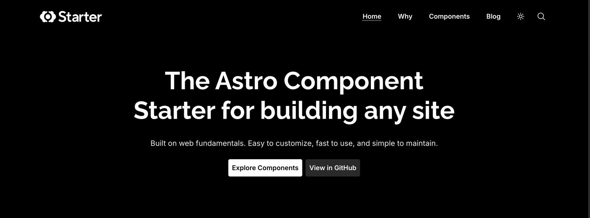
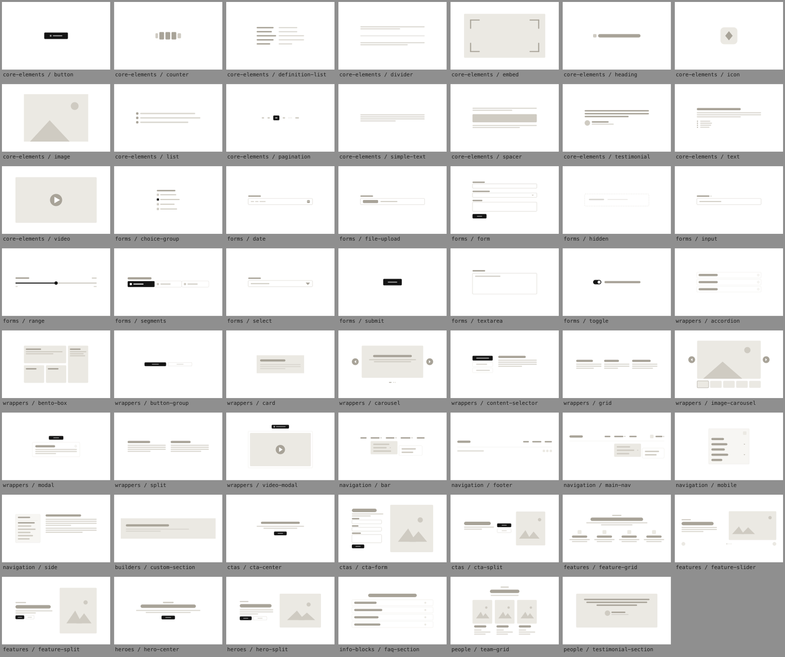

# Astro Component Starter

A starter template with 55 Astro components, each built for visual editing in
[CloudCannon](https://cloudcannon.com/). You clone it, you own it. Every component is your
source code to modify, extend, or delete.

**[Live demo](https://astro-component-starter.cc/)** ·
**[Component docs](https://astro-component-starter.cc/component-docs/)** ·
**[Component builder](https://astro-component-starter.cc/component-docs/component-builder/)**

[](https://astro-component-starter.cc/)

The design is intentionally unbranded so it can morph into any brand you want. Update CSS
variables and the entire site shifts to match your colors, fonts, and identity. Components are
built on web fundamentals: vanilla CSS, semantic HTML, and a sprinkling of vanilla JS only when
something can't be done with CSS alone. Performance and accessibility are baked in from the start.

## Quick Start

```bash
npx create-astro-component-starter my-site-name
cd my-site-name
npm run dev
```

Your site is now running at `http://localhost:4321`.

This command scaffolds the latest starter into a local project folder, sets the starter repo as
`upstream`, and installs dependencies automatically.

**Make your first change:** Open `src/content/pages/index.md`, change the hero heading, and watch
it update in your browser.

**Then make it yours:**

```bash
npm run reset:starter
```

This asks for your site name and production URL, then clears out the demo content — the sample
blog posts, the starter's own pages, and its logos and navigation. It also sets `site` in
`astro.config.mjs`, which every canonical URL, sitemap entry, RSS link, and JSON-LD record is
built from. Left at its placeholder, all of them point at a domain you don't own, and nothing
errors. `npm run check` warns until it's set.

## What You'll See

- **Your site** at [localhost:4321](http://localhost:4321), a fully working demo with pages, blog,
  search, and navigation
- **Component docs** at [localhost:4321/component-docs/](http://localhost:4321/component-docs/) —
  eight guides, a live example and prop table for every component, a gallery, and a drag-and-drop
  component builder that exports a complete component package

## Why This Starter

- **Components are born CMS-editable.** Every component ships its editor schema beside it. There's
  no second project to "make it editable" — add a component and it appears in the editor's Add
  menu with a preview.
- **Design lives in tokens, not components.** The same 55 components render as a law firm, a SaaS
  product, or a university department by swapping token files. No component CSS to fight.
- **It's built to be operated by AI.** Ten skills in `.agents/skills/` encode the workflows —
  create a component, turn a screenshot into one, migrate an existing site, retheme — as
  playbooks your coding agent can follow. The conventions are what make its output predictable.
- **The output is boring, excellent Astro.** Static, no runtime, tiny JS payload, inlined CSS,
  and top-tier Core Web Vitals by construction.

## Components

55 components across three tiers — 12 page sections, 38 building blocks, and 5 navigation
components — plus 343 icons.

[](https://astro-component-starter.cc/component-docs/)

## The Three-File Pattern

Every component in this starter ships with three files. This is what makes the system work:
developers build components, editors visually manage content.

```
src/components/.../button/
├── Button.astro                          # The component
├── button.cloudcannon.inputs.yml         # What editors see and can change
└── button.cloudcannon.structure-value.yml # Defaults and picker metadata
```

Scaffold all three, wired up correctly:

```bash
npm run new:component building-blocks/core-elements/my-thing
```

## Key Directories

```
src/
├── components/          # All 55 components (yours to edit)
│   ├── building-blocks/ # Core UI: buttons, headings, forms, layout wrappers
│   ├── page-sections/   # Full-width sections: heroes, features, CTAs
│   └── navigation/      # Header, footer, mobile nav
├── content/             # Your pages and blog posts (Markdown/MDX)
├── data/                # Site nav, footer, and SEO defaults (editable in the CMS)
├── styles/              # Design tokens, themes, base styles
│   ├── variables/       # Colors, fonts, spacing, widths
│   └── themes/          # Light and dark theme definitions
└── component-docs/      # Built-in docs (excluded from production builds)
```

## Making It Your Brand

Rebranding is a token change, not a redesign:

- **Colors, spacing, radius, shadows, type scale** — `src/styles/variables/`
- **Light and dark semantics** — `src/styles/themes/_light.css` and `_dark.css`
- **Fonts** — `site-fonts.mjs`, the single source of truth
- **Nav, footer, SEO defaults** — `src/data/*.json`

`npm run lint:css-vars` fails the build on any `var(--x)` that doesn't resolve, which catches the
silent-failure class of theming bug. The
[theming guide](https://astro-component-starter.cc/component-docs/customizing-your-brand/)
walks through it.

## Commands

| Command                      | Description                                                    |
| ---------------------------- | -------------------------------------------------------------- |
| `npm run dev`                | Start the development server                                   |
| `npm run build`              | Build for production (component docs excluded, search indexed) |
| `npm run build:with-library` | Build for production with component docs included              |
| `npm run check`              | The full gate — lint, format, types, and every drift check     |
| `npm run check:fix`          | Auto-fix lint and formatting                                   |
| `npm run new:component`      | Scaffold a component and its CloudCannon schema                |
| `npm run reset:starter`      | Clear the demo content and set your site name and URL          |
| `npm run test:unit`          | Unit tests (Vitest)                                            |
| `npm run test:render`        | Verify every component's defaults build                        |
| `npm run test:smoke`         | Headless-browser checks against the built site                 |

Run `npm run check` before you commit — it's what CI runs, and it catches schema drift between a
component and its editor config, which nothing else will.

## Deploying

See **[docs/DEPLOYMENT.md](docs/DEPLOYMENT.md)**. The repository ships CloudCannon's build
settings, so connecting it is a few clicks — and component schemas are picked up automatically.

## Prerequisites

- **Node.js 22.12 or later.** The repo pins `24.18.0` in `.nvmrc`, which is the version CI uses.

## Updating Dependencies

When adding, removing, or updating packages (on macOS especially), use:

```bash
npm run deps:sync
```

This regenerates `package-lock.json` with resolutions for all target platforms (Linux, Windows,
macOS) so CI doesn't break. Plain `npm install` on macOS silently strips Linux-only peer
dependencies out of the lockfile, which causes `npm ci` to fail on GitHub Actions.

You can verify the lockfile is CI-ready at any time with:

```bash
npm run deps:check
```

## Learn More

- **[Component docs](https://astro-component-starter.cc/component-docs/)** — guides, every
  component's props, and the component builder. Also at `/component-docs/` in your dev server.
- **[docs/ARCHITECTURE.md](docs/ARCHITECTURE.md)** — how content becomes HTML, the component
  registry, and the patterns not to refactor.
- **[docs/DEPLOYMENT.md](docs/DEPLOYMENT.md)** — deploying to CloudCannon.
- **[CONTRIBUTING.md](CONTRIBUTING.md)** — adding a component and the checks it has to pass.
- **`.agents/skills/`** — the workflow playbooks, for you or your coding agent.

## License

[MIT](LICENSE)
